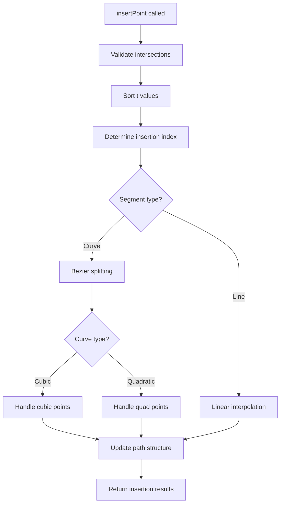
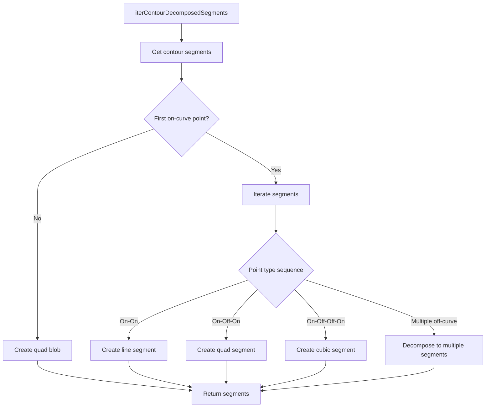

# Fontra Path Operations Analysis

This document provides a technical analysis of Fontra's path operations implementation, focusing on the core data structures and functions that handle path manipulation in the application.

## Table of Contents
1. [VarPackedPath Data Structure](#varpackedpath-data-structure)
2. [Point Insertion Operations](#point-insertion-operations)
3. [Curve Handling Mechanisms](#curve-handling-mechanisms)
4. [Path Manipulation Functions](#path-manipulation-functions)
5. [Segment Operations](#segment-operations)
6. [Bézier Curve Representation and Manipulation](#bézier-curve-representation-and-manipulation)
7. [Helper Functions](#helper-functions)

## VarPackedPath Data Structure

The `VarPackedPath` class is the core data structure for representing paths in Fontra. It's designed to efficiently store path data with the following key characteristics:

### Structure
- `coordinates`: A `VarArray` storing x,y coordinate pairs as sequential values
- `pointTypes`: An array of point type flags using bitmask values:
  - `ON_CURVE` (0x00): Regular on-curve points
  - `OFF_CURVE_QUAD` (0x01): Quadratic off-curve points
  - `OFF_CURVE_CUBIC` (0x02): Cubic off-curve points
  - `SMOOTH_FLAG` (0x08): Flag indicating smooth points
- `contourInfo`: Array of objects tracking contour endpoints and closure status
- `pointAttributes`: Optional array for storing additional point attributes

### Key Features
- Efficient memory usage through packed coordinate storage
- Support for both quadratic and cubic Bézier curves
- Variable font compatibility with `VarArray` for coordinates
- Methods for common path operations (insert, delete, move points)
- Contour-based organization with closure tracking

### Point Types
Points in Fontra can be:
1. **On-curve points**: Anchor points that define the path
2. **Off-curve points**: Control points for curves
   - Quadratic (single control point)
   - Cubic (two control points)
3. **Smooth points**: On-curve points with automatically adjusted handles

## Point Insertion Operations

The `insertPoint` function in `path-functions.js` handles insertion of new points into existing paths:

### Process Flow
1. Validates that additional intersections are on the same segment
2. Sorts intersection parameters (t values)
3. Determines insertion index based on contour structure
4. Handles two distinct cases:
   - **Line insertion**: Simple linear interpolation between existing points
   - **Curve insertion**: Complex Bézier curve splitting with handle management

### Curve Insertion Details
- Uses `bezierSplitMultiple` to subdivide curves at specified t values
- Handles both cubic and quadratic curve types differently:
  - **Cubic**: Maintains cubic control points with proper smoothing
  - **Quadratic**: Manages implied on-curve points between off-curve points
- Preserves curve continuity by adjusting control handles
- Properly updates path structure and indices after insertion

### Special Handling
- Implied points: When inserting in quadratic curves, calculates midpoints between control points
- Handle management: Ensures proper control point positioning for smooth curves
- Index adjustment: Correctly updates all affected point indices after insertion

## Curve Handling Mechanisms

Fontra supports both quadratic and cubic Bézier curves with sophisticated handling:

### Curve Representation
- Curves are defined by sequences of points:
  - **Quadratic**: On-curve → Off-curve → On-curve
  - **Cubic**: On-curve → Off-curve → On-curve
- Multiple consecutive off-curve points are automatically converted to piecewise curves

### Curve Decomposition
The `iterContourDecomposedSegments` method breaks complex contours into individual segments:
- Converts multi-point quadratic sequences to multiple single quadratic curves
- Handles special cases like "quad blobs" (closed paths with only off-curve points)
- Properly identifies segment types (line, quad, cubic) based on point types

### Curve Fitting
The `fitCubic` function provides curve fitting capabilities:
- Implements Newton-Raphson root finding for parameter optimization
- Uses chord-length parameterization for initial point distribution
- Iteratively refines curve parameters to minimize error
- Handles both single-segment and multi-segment curve fitting

## Path Manipulation Functions

Fontra provides several functions for comprehensive path manipulation:

### Path Filtering
`filterPathByPointIndices` creates new paths containing only selected points:
- Expands selection to include related off-curve points
- Handles both open and closed contours
- Supports cutting mode to remove selected portions from original path

### Path Splitting
`splitPathAtPointIndices` divides paths at specified points:
- Properly handles closed contours by first opening them
- Maintains path structure integrity during splitting
- Correctly updates contour indices after operations

### Path Connection
`connectContours` joins separate contours:
- Can close open contours by connecting endpoints
- Merges different contours by connecting specified points
- Handles contour orientation and point ordering

### Point Deletion
`deleteSelectedPoints` removes points with intelligent curve reconstruction:
- Preserves curve shape when deleting segments
- Recalculates control handles to maintain smoothness
- Handles special cases like deleting entire contours

## Segment Operations

Segments are fundamental units of path geometry in Fontra:

### Segment Types
1. **Line segments**: Two on-curve points
2. **Quadratic segments**: On-curve → Off-curve → On-curve
3. **Cubic segments**: On-curve → Off-curve → On-curve
4. **Quad blobs**: Special closed contours with only off-curve points

### Segment Iteration
The `iterContourSegmentPointIndices` generator provides access to segment structure:
- Identifies first on-curve point as starting reference
- Groups points into logical segments based on point types
- Handles both open and closed contour topologies

### Segment Decomposition
Complex segments are broken down into simpler components:
- Multi-point quadratic sequences become multiple single quadratic curves
- Cubic segments with extra control points are simplified
- Quad blobs are converted to standard quadratic curves

## Bézier Curve Representation and Manipulation

Fontra uses the external `bezier-js` library for core Bézier operations:

### Core Operations
- Curve evaluation at parameter values (t)
- Derivative calculations for tangents and normals
- Curve splitting at parameter values
- Extrema finding for bounding box calculations

### Curve Manipulation
- **Splitting**: Divides curves at specified t values using de Casteljau's algorithm
- **Fitting**: Approximates point sequences with Bézier curves using least squares
- **Interpolation**: Computes intermediate points along curves

### Specialized Functions
- `bezierSplitMultiple`: Efficiently splits curves at multiple t values
- `generateBezier`: Creates Bézier curves from point constraints
- `computeMaxError`: Measures curve approximation quality

## Helper Functions

Fontra includes numerous utility functions to support path operations:

### Vector Operations
- `addVectors`, `subVectors`: Basic vector arithmetic
- `mulVectorScalar`: Vector scaling
- `vectorLength`: Euclidean distance calculation
- `normalizeVector`: Unit vector computation
- `interpolateVectors`: Linear interpolation between vectors

### Geometric Utilities
- `intersect`: Line-line intersection with parameter calculation
- `distance`: Point-point distance
- `rotateVector90CW`: Vector rotation by 90 degrees

### Path Utilities
- `modulo`: Python-style modulo for cyclic indexing
- `reversed`: Reverse iteration generator
- `enumerate`: Indexed iteration with custom start
- `range`: Python-style range generator

### Validation and Assertion
- `assert`: Runtime assertion checking
- `pointCompareFunc`: Numerically stable point comparison
- Various integrity checking functions

## Data Flow Patterns

### Point Insertion Flow

### Curve Decomposition Flow

## Conclusion

Fontra's path operations provide a comprehensive system for manipulating Bézier paths with attention to both efficiency and correctness. The design emphasizes:

1. **Memory efficiency** through packed data structures
2. **Mathematical correctness** in curve operations
3. **Flexibility** in supporting both quadratic and cubic curves
4. **Robustness** in handling edge cases and complex path topologies
5. **Extensibility** through modular design and clear interfaces

The system is particularly well-suited for font editing applications where precise curve manipulation and variable font support are essential.