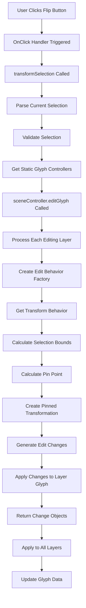

# Flip Selection Function in Transformation Panel

## Overview

The flip selection function in Fontra's transformation panel allows users to flip selected glyph elements (points, components, anchors) either horizontally or vertically. This document details the complete flow from UI interaction to actual glyph transformation.

## UI Components

The flip functionality is implemented in [`src-js/views-editor/src/panel-transformation.js`](src-js/views-editor/src/panel-transformation.js) with two icon buttons:

1. **Flip Vertically** - Uses icon `/tabler-icons/flip-vertical.svg`
2. **Flip Horizontally** - Uses icon `/tabler-icons/flip-horizontal.svg`

These buttons are defined in lines 423-462 of the panel-transformation.js file:

```javascript
// Flip Vertically Button
html.createDomElement("icon-button", {
  "class": "ui-form-icon",
  "src": "/tabler-icons/flip-vertical.svg",
  "data-tooltip": translate("sidebar.selection-transformation.flip.vertically"),
  "data-tooltipposition": "top",
  "onclick": (event) =>
    this.transformSelection(
      () => new Transform().scale(-1, 1),
      "flip vertically"
    ),
}),

// Flip Horizontally Button
html.createDomElement("icon-button", {
  "class": "ui-form-icon",
  "src": "/tabler-icons/flip-horizontal.svg",
  "data-tooltip": translate("sidebar.selection-transformation.flip.horizontally"),
  "data-tooltipposition": "top-right",
  "onclick": (event) =>
    this.transformSelection(
      () => new Transform().scale(1, -1),
      "flip horizontally"
    ),
}),
```

## Data Flow

### 1. User Input Handling

When a user clicks either flip button:
1. The `onclick` handler is triggered
2. It calls `this.transformSelection()` with:
   - A transformation function that returns a `Transform` object with appropriate scale values
   - An undo label string ("flip vertically" or "flip horizontally")

### 2. Transform Selection Method

The `transformSelection` method in [`src-js/views-editor/src/panel-transformation.js`](src-js/views-editor/src/panel-transformation.js) (lines 790-871) handles the transformation process:

1. **Selection Parsing**: Extracts point, component, anchor, and backgroundImage indices from the current selection
2. **Validation**: Ensures at least one element is selected
3. **Static Glyph Controllers**: Retrieves static glyph controllers for all editing layers
4. **Edit Glyph Operation**: Calls `this.sceneController.editGlyph()` to perform the transformation

### 3. Scene Controller Integration

The `editGlyph` method in [`src-js/views-editor/src/scene-controller.js`](src-js/views-editor/src/scene-controller.js) manages the actual transformation:

1. **Layer Processing**: Iterates through all editing layers
2. **Edit Behavior Factory**: Creates an `EditBehaviorFactory` for each layer
3. **Transform Behavior**: Gets a transform behavior using `behaviorFactory.getTransformBehavior("default")`
4. **Selection Bounds**: Calculates bounds of the selected elements
5. **Pin Point Calculation**: Determines the transformation origin point based on user-selected origin
6. **Transformation Application**: 
   - Creates a pinned transformation by translating to the pin point, applying the transformation, and translating back
   - Generates edit changes using `editBehavior.makeChangeForTransformation()`
   - Applies changes to the layer glyph

### 4. Transformation Execution

The actual transformation is performed using the `Transform` class from [`@fontra/core/transform.js`](src/fontra/core/transform.py):

- **Flip Vertically**: `new Transform().scale(-1, 1)` - Negates X coordinates
- **Flip Horizontally**: `new Transform().scale(1, -1)` - Negates Y coordinates

The transformation is applied around a pin point which is calculated based on the selection bounds and user-selected origin (center by default).

## Key Functions and Data Structures

### Main Functions

1. **`transformSelection(transformationForLayer, undoLabel)`** - Panel method that initiates the transformation
2. **`getPinPoint(bounds, originX, originY)`** - Calculates the transformation origin point
3. **`editGlyph(editFunc, senderID)`** - Scene controller method that manages the edit operation
4. **`makeChangeForTransformation(transformation)`** - Edit behavior method that generates changes

### Data Structures

1. **`Transform`** - Represents 2D transformations with methods for scale, translate, rotate, etc.
2. **Selection Sets** - JavaScript Sets containing selected element identifiers (e.g., "point/5", "component/2")
3. **Layer Glyphs** - Objects representing glyph data for specific layers
4. **Edit Behaviors** - Objects that understand how to apply transformations to different element types

## Detailed Process Flow



## Transformation Details

The flip transformation uses affine transformations represented by the `Transform` class:

- **Flip Vertically**: Scale(-1, 1) - Inverts the X coordinates while keeping Y coordinates the same
- **Flip Horizontally**: Scale(1, -1) - Inverts the Y coordinates while keeping X coordinates the same

The transformation is applied relative to a pin point which by default is the center of the selection bounds, but can be changed by the user through the origin selection UI.

## Edit Behavior System

The edit behavior system handles how transformations are applied to different element types:

1. **Points**: Direct coordinate transformation
2. **Components**: Transformation of component origins and transformation matrices
3. **Anchors**: Direct coordinate transformation
4. **Background Images**: Direct coordinate transformation

Each element type has specific handling for how transformation matrices are applied while preserving the integrity of the glyph structure.